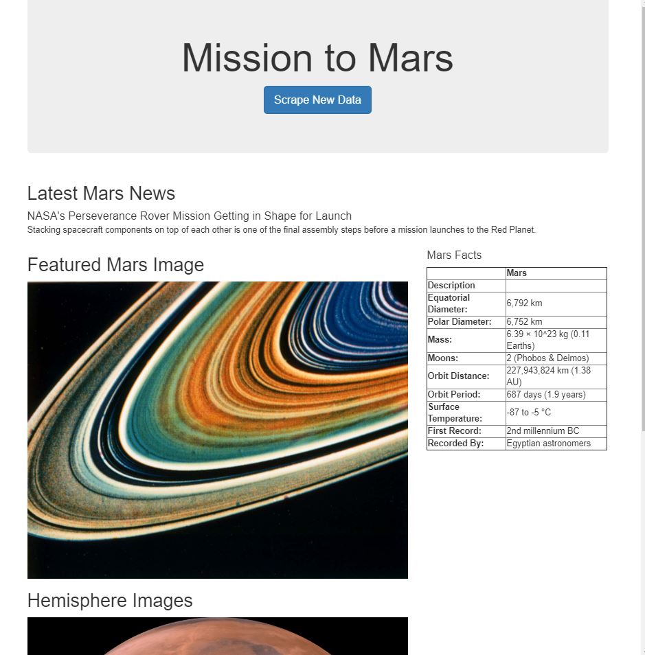
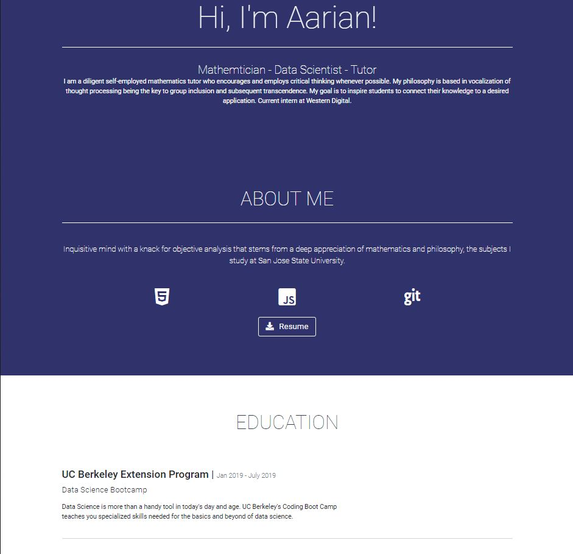

# Mission-to-Mars
In this repository, I created a flask application that can scrape data from the NASA website as well as from an astrogeology.usgs website, which is also essentially NASA affiliated. The code scrapes these websites for data and implements a button to update the information. The application uses BeautifulSoup to scrape, pandas to transform, and mongoDB/HTML to store and re upload the code as a .html file that can be run from other devices. (note: for hemisphere information, run challenge.py or challenge.ipynb)

## Portfolio
This is my portforlio, containing this project and others (see github repo -- "my_portfolio")

